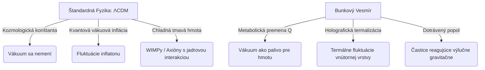

# Bunkový vesmír: Učebnica a kompletný sprievodca teóriou
**Verzia sprievodcu:** v1.3 (Zodpovedá verzii teórie v3.18)  
**Dátum:** 11. júl 2026  
**Odhadovaný čas štúdia:** 4 – 6 hodín intenzívneho samoštúdia (bez potreby otvárania externej literatúry).  
**Autor:** Martin Jambor (Samostatný výskumník)  
**Oponent a editor:** Antigravity (Google DeepMind AI)

---

## Predhovor: Ako študovať tento dokument
Tento sprievodca slúži ako komplexný učebný a oponentský text k teórii Bunkového vesmíru. Zlučuje filozofické, geometrické a astrofyzikálne dôkazy do jedného celku. Text je koncipovaný s dvoma úrovňami výkladu:
1.  **Základný popularizačný výklad:** Používa analógie a názorné príklady pre širokú verejnosť.
2.  > 🔍 **Hlbší ponor (Pre pokročilých):** Obsahuje rigorózny matematický a fyzikálny aparát pre vysokoškolských študentov a oponentov.

V celom texte sú zapracované priame odkazy na všetky časti kľúčových dokumentov projektu:
*   Úvod a Filozofia: [01_Introduction_and_Philosophy_SK.md](file:///d:/Teoria/theory/SK/01_Introduction_and_Philosophy_SK.md)
*   Hlavný matematický dokument: [04_Main_Document_Theory_Equations_Values_v3.17_SK.md](file:///d:/Teoria/theory/SK/04_Main_Document_Theory_Equations_Values_v3.17_SK.md)
*   Tabuľka predikcií: [02b_Predictions_Table_v3.17_SK.pdf](file:///d:/Teoria/theory/SK/02b_Predictions_Table_v3.17_SK.pdf)
*   Metodické pravidlá a otázky: [05_Methodology_Rules_and_Question_Register_SK.md](file:///d:/Teoria/theory/SK/05_Methodology_Rules_and_Question_Register_SK.md)

---

## 1. Úvod: Vesmír ako živé tkanivo (Základné metafory)

### 1.1 Laický výklad
Predstavte si priestor nie ako prázdnu statickú krabicu, ale ako rastúcu penu. V tejto teórii sa priestor skladá z nepredstaviteľne malých **buniek** veľkosti Planckovej dĺžky ($10^{-35}\,\text{m}$). Tieto bunky žijú vlastným metabolizmom:
1.  **Potrava (Palivo vákua):** Bunky absorbujú energiu vákua.
2.  **Delenie:** Keď bunka spotrebuje dostatok paliva, rozdelí sa na dve. **Rozpínanie vesmíru je priamym dôsledkom tohto delenia buniek.** Vesmír sa nerozpína *do* niečoho, rastie samotné jeho tkanivo.
3.  **Daň z delenia (Réžia $\delta$):** Pri každom delení musí bunka prestaviť svoje susedské prepojenia. To nie je zadarmo — réžia $\delta$ zožerie približne $2.3\,\%$ celkovej energie. Z tejto jednoduchej dane pramenia tri najväčšie záhady kozmológie (Hubbleovo napätie, sklon perturbácií $n_s$ a tvar tmavej energie).
4.  **Rebrík odpadových produktov:**
    *   *Obyčajná hmota:* Zriedkavá chyba (1-krát za $10^{123}$ delení), kedy bunka stuhne a vytvorí atóm.
    *   *Tmavá hmota (popol):* Odpad dotrávený do úplného konca, ktorý s okolím reaguje iba gravitačnou silou.
    *   *Para:* Tepelné vlnky sieci uniknuté pri divokom vzniku vesmíru, ktoré dnes tvoria slabučké pozadie s teplotou $0.9\,\text{K}$.
5.  **Účtovný tieň (Tmavá energia):** Pretože tradiční kozmológovia predpokladajú, že hmota sa iba riedi a jej celkové množstvo sa nemení, premena paliva na hmotu vytvára v ich prepočtoch zdanlivú odpudivú silu, ktorú my nazývame tmavá energia.

**Interné odkazy:**
*   [01_Philosophy: Sekcia 1 (Otázka na začiatku)](file:///d:/Teoria/theory/SK/01_Introduction_and_Philosophy_SK.md#L8-L17)
*   [01_Philosophy: Sekcia 2 (Postavy príbehu)](file:///d:/Teoria/theory/SK/01_Introduction_and_Philosophy_SK.md#L18-L38)
*   [01_Philosophy: Sekcia 3 (Jedna daň, tri záhady)](file:///d:/Teoria/theory/SK/01_Introduction_and_Philosophy_SK.md#L39-L48)

---

> 🔍 **Hlbší ponor (Pre pokročilých): Diskrétnosť na Planckovej škále a zlyhanie mriežky**
> 
> V klasickej kvantovej teórii poľa sa časopriestor považuje za hladké pozadie (varietu). Avšak pri pokusoch o kvantovanie gravitácie narážame na ultrafialové singularity (nekonečné hodnoty). Diskrétne modely (napr. *Loop Quantum Gravity* — LQG alebo *Causal Dynamical Triangulations* — CDT) sa snažia priestor diskretizovať. 
> 
> Ak však priestor diskretizujeme pomocou pravidelnej mriežky (ako v kryštáloch), zavedieme smerovú preferenciu a rýchlosť svetla by mala závisieť od smeru vlnenia, čo by hrubo narušilo Lorentzovu symetriu (experimentálne overenú s presnosťou na $10^{-20}$).
> 
> Bunkový vesmír tento problém obchádza tým, že **priestor definuje ako Poissonov-Delaunayov náhodný graf**. V náhodnom grafe neexistuje preferovaný smer, a smerové fluktuácie rýchlosti šírenia vĺn sa pri prechode do makroskopických škál priemerujú k nule rýchlosťou:
> \[
> \langle \Delta c^2 \rangle \;\propto\; N^{-1/3}
> \]
> kde $N$ je počet uzlov (buniek) v bloku. Pre fyzikálne vlnové dĺžky ($\lambda \sim 10^{-6}\,\text{m}$) je počet Planckových buniek v bloku $N \sim 10^{87}$, čo potláča akékoľvek smerové narušenia na úroveň $10^{-29}$ — ďaleko pod hranicu merateľnosti.
> 
> **Vzťah k teórii:**
> *   Dôkaz geodetického zaostrovania a KPZ: [04_Main_Document: Sekcia A4 (Emergentný svetelný kužeľ)](file:///d:/Teoria/theory/SK/04_Main_Document_Theory_Equations_Values_v3.17_SK.md#L45-L48)
> *   Zhrnutie Lorentzovej stability: [04_Main_Document: Sekcia A5 (Disperzia vĺn)](file:///d:/Teoria/theory/SK/04_Main_Document_Theory_Equations_Values_v3.17_SK.md#L49-L55)

---

## 2. Fyzikálna rozbiehavosť s modelom $\Lambda$CDM a svetovou fyzikou

Aby sme pochopili hĺbku tohto modelu, musíme presne vidieť, kde sa rochádza so zavedenou fyzikou.

### 2.1 Porovnanie kľúčových pilierov bod po bode

#### 1. Povaha vákua a Tmavej energie
*   **ΛCDM:** Tmavá energia je konštantná kozmologická konštanta $\Lambda$ ($w = -1, w_a = 0$). Jej hustota je nemenná a jej extrémne nízka hodnota ($10^{-120}$ voči QFT odhadom) predstavuje najväčšiu tenziu modernej fyziky.
*   **Bunkový vesmír:** Neexistuje žiadna fundamentálna konštanta $\Lambda$. Palivo vákua je spotrebovávané bunkami priestoru a mení sa na hmotu prostredníctvom prenosu:
    \[
    Q \;=\; \lambda H_0 \rho_f
    \]
    Únik paliva a pribúdanie hmoty vytvára **účtovný tieň**, ktorý sa v CPL parametrizácii javí ako dynamická tmavá energia so slabnúcim priebehom ($w_a < 0$, konkrétne $w_a \approx -0.4\text{--}-0.6$).
*   **Interné prepojenia:**
    - [02b_Predictions_Table: Riadok 6 (w_0, w_a)](file:///d:/Teoria/theory/SK/02b_Predictions_Table_v3.17_SK.pdf)
    - [04_Main_Document: Sekcia A8 (Účtovný tieň V2)](file:///d:/Teoria/theory/SK/04_Main_Document_Theory_Equations_Values_v3.17_SK.md#L70-L74)
    - Porovnanie tmavej energie: [04_Main_Document: Časť B (Porovnávacia tabuľka, riadky 1, 2)](file:///d:/Teoria/theory/SK/04_Main_Document_Theory_Equations_Values_v3.17_SK.md#L112-L117)

#### 2. Pôvod prahrudiek (CMB fluktuácií) a Kozmická inflácia
*   **ΛCDM:** Vesmír prešiel infláciou vyvolanou rýchlym poklesom energetického potenciálu inflatonového poľa. Perturbácie hustoty vznikli z kvantových fluktuácií tohto poľa, čo predpovedá zistiteľné prvotné tenzorové vlny ($r \sim 10^{-3}\text{--}10^{-2}$).
*   **Bunkový vesmír:** Vesmír nemal žiadne inflatonové pole. Éra kvázi-de Sitterovského rozpínania bola poháňaná priamo vysokým nasýtením paliva. Perturbácie vznikli ako termálne fluktuácie holografickej vnútornej vrstvy v nasýtenom Hagedornovom režime. Amplitúda tenzorov je extrémne potlačená ($r < 10^{-10}$, reálne $\sim 10^{-20}$), pretože tenzory vznikajú len z tepelného vlnenia sieci.
*   **Interné prepojenia:**
    - [02b_Predictions_Table: Riadok 2 (n_s)](file:///d:/Teoria/theory/SK/02b_Predictions_Table_v3.17_SK.pdf)
    - [02b_Predictions_Table: Riadok 3 (Prvotné r)](file:///d:/Teoria/theory/SK/02b_Predictions_Table_v3.17_SK.pdf)
    - [04_Main_Document: Sekcia A13 (Spektrum perturbácií)](file:///d:/Teoria/theory/SK/04_Main_Document_Theory_Equations_Values_v3.17_SK.md#L93-L101)
    - Porovnanie inflácie: [04_Main_Document: Časť B (Riadky 4, 5)](file:///d:/Teoria/theory/SK/04_Main_Document_Theory_Equations_Values_v3.17_SK.md#L119-L121)

#### 3. Tmavá hmota (CDM)
*   **ΛCDM:** Tmavá hmota je zložená zo slabokomunikujúcich častíc (WIMP) alebo axiónov, ktoré by mali mať okrem gravitačnej aj slabučkú interakciu s jadrami bežnej hmoty.
*   **Bunkový vesmír:** Tmavá hmota je kompletne dotráveným odpadom (popolom). Popol resizuje **výhradne v gravitačnej doméne ($G$)** a nemá žiadnu elektromagnetickú ani slabú jadrovú interakciu. Preto všetky priame detektory (LZ, DARWIN) uvidia navždy čistú nulu.
*   **Interné prepojenia:**
    - [02b_Predictions_Table: Riadok 7 (Priama detekcia tmavej hmoty)](file:///d:/Teoria/theory/SK/02b_Predictions_Table_v3.17_SK.pdf)
    - [04_Main_Document: Sekcia A12 (Popol vs. Para)](file:///d:/Teoria/theory/SK/04_Main_Document_Theory_Equations_Values_v3.17_SK.md#L88-L92)
    - Porovnanie tmavej hmoty: [04_Main_Document: Časť B (Riadok 3)](file:///d:/Teoria/theory/SK/04_Main_Document_Theory_Equations_Values_v3.17_SK.md#L118-L118)

#### 4. Reliktné pozadie a neutrínové vákuum
*   **ΛCDM:** Celková hustota energie ľahkých relativistických reliktov je vyjadrená pomocou neutrínového parametra $N_{\text{eff}} = 3.045$.
*   **Bunkový vesmír:** Zbesilý metabolizmus genézy priestoru vypustil tepelné vlnky sieci (paru) s teplotou $0.9\,\text{K}$. Para sa správa ako dodatočný relativistický relikt, čo zvyšuje spektrálnu hodnotu na $N_{\text{eff}} = 3.10$.
*   **Interné prepojenia:**
    - [02b_Predictions_Table: Riadok 1 (N_eff)](file:///d:/Teoria/theory/SK/02b_Predictions_Table_v3.17_SK.pdf)
    - [04_Main_Document: Sekcia A12 (Entropia a para)](file:///d:/Teoria/theory/SK/04_Main_Document_Theory_Equations_Values_v3.17_SK.md#L88-L92)
    - Porovnanie reliktov: [04_Main_Document: Časť B (Riadok 7, N_eff)](file:///d:/Teoria/theory/SK/04_Main_Document_Theory_Equations_Values_v3.17_SK.md#L122-L122)

---

## 3. Odvodenia a matematika vzorcov

### 3.1 Geometria a priemerný stupeň susedstva $\langle k\rangle$
*   **Vzorec:**
    \[
    \langle k\rangle \;=\; \frac{48\pi^2}{35} + 2
    \]

#### Tabuľkový rozbor parametrov:
| Parameter | Fyzikálny význam | Jednotka | Presná hodnota | Úloha vo vzorci a citlivosť |
| :--- | :--- | :--- | :--- | :--- |
| **$\langle k\rangle$** | Priemerný počet susedov | bezrozmerný | $15.535$ | Vyjadruje priemerný počet stien 3D Voronoiho buniek priestoru. Určuje plochu vonkajšieho susedstva bunky. |
| **$\pi$** | Pomer obvodu k priemeru kruhu | bezrozmerný | $\approx 3.14159$ | Matematická konštanta definujúca izotropiu priestorových sfér v 3D. |
| **$\frac{48}{35}$** | Topologický zlomok | bezrozmerný | konštanta | Vyplýva z integrácie uhlových závislostí pri náhodnom delení priestoru. |
| **$+2$** | Normalizačný posun | bezrozmerný | konštanta | Eulerov topologický korekčný faktor pre uzavreté Eulerove mnohosteny. |

*   **Základný výklad:** Ak rozsypete v miestnosti body a okolo každého začnete fúkať bublinu, bubliny sa stretnú a vytvoria penu. Matematika dokazuje, že v trojrozmernom svete bude mať každá bublina v priemere presne 15.54 susedov. Toto číslo nevyberáme my, diktuje ho čistá geometria.
*   **Interné prepojenia:**
    - [04_Main_Document: Sekcia A1 (Geometria siete)](file:///d:/Teoria/theory/SK/04_Main_Document_Theory_Equations_Values_v3.17_SK.md#L30-L33)
    - Overenie v simulácii rastu: [05_Methodology: Sekcia Časť 7 (Otázka Q1)](file:///d:/Teoria/theory/SK/05_Methodology_Rules_and_Question_Register_SK.md#L35-L36)

---

### 3.2 Réžia delenia (Daň) $\delta$
*   **Vzorec:**
    \[
    \delta \;=\; \frac{1}{\langle k\rangle + C}
    \]

#### Tabuľkový rozbor parametrov:
| Parameter | Fyzikálny význam | Jednotka | Presná hodnota | Úloha vo vzorci a fyzikálna citlivosť |
| :--- | :--- | :--- | :--- | :--- |
| **$\delta$** (delta) | Réžia delenia (daň) | bezrozmerný | $0.02297$ | Vyjadruje podiel stratenej energie pri delení bunky. Citlivosť: Zmena $\delta$ o $1\,\%$ posunie hodnotu spektrálneho indexu $n_s$ o $1.5\sigma$. |
| **$\langle k\rangle$** | Priemerný stupeň susedstva | bezrozmerný | $15.535$ | Reprezentuje počet povrchových (vonkajších) susedských väzieb bunky. |
| **$C$** | Kapacita vnútra (bozóny) | bezrozmerný | $28$ | Vyjadruje počet vnútorných kvantových prepojení (kanálov). |

*   **Základný výklad:** Delenie bunky (rozpínanie vesmíru) nie je zadarmo. Nová bunka musí vybudovať susedské prepojenia. Disipačná daň $\delta$ predstavuje prevrátenú hodnotu všetkých prepojení (povrchových $\langle k\rangle$ + vnútorných $C$). Vychádza presne na $2.3\,\%$.
*   **Interné prepojenia:**
    - [04_Main_Document: Sekcia A2 (Réžia delenia)](file:///d:/Teoria/theory/SK/04_Main_Document_Theory_Equations_Values_v3.17_SK.md#L34-L38)
    - Odvodenie kapacity $C=28$: [04_Main_Document: Sekcia A3 (Kapacita vnútra)](file:///d:/Teoria/theory/SK/04_Main_Document_Theory_Equations_Values_v3.17_SK.md#L39-L44)
    - Jensenova nerovnosť vo VCM: [05_Methodology: Sekcia Časť 7 (Otázka Q2)](file:///d:/Teoria/theory/SK/05_Methodology_Rules_and_Question_Register_SK.md#L36-L36)

---

### 3.3 Disperzia vĺn na sieti $\omega^2(k)$
*   **Vzorec:**
    \[
    \omega^2(k) \;=\; \frac{2}{N}\sum_{\text{hrany}} \left[1 - \cos\left(\vec{k}\cdot\vec{\delta}_i\right)\right]
    \]

#### Tabuľkový rozbor parametrov:
| Parameter | Fyzikálny význam | Jednotka | Hodnota | Úloha vo vzorci a fyzikálna citlivosť |
| :--- | :--- | :--- | :--- | :--- |
| **$\omega$** (omega) | Uhlová frekvencia | $\text{s}^{-1}$ | premenná | Frekvencia kmitania vlnenia (svetla/gravitácie) šíriaceho sa po grafe. Vystupuje v druhej mocnine. |
| **$\vec{k}$** | Vlnový vektor | $\text{m}^{-1}$ | premenná | Definuje hybnosť a smer vlnenia. Vlnová dĺžka je $\lambda = 2\pi/k$. |
| **$\vec{\delta}_i$** | Susedský vektor prepojenia | meter ($\text{m}$) | $\sim 10^{-35}\,\text{m}$ | Vektor spájajúci uzol $i$ so susedom na Planckovej škále. |
| **$N$** | Počet hrán v bloku | bezrozmerný | závisí od objemu | Normalizačný faktor pre výpočet grafového Laplaciánu. |

*   **Základný výklad:** Ak má vlnenie (napríklad svetlo) veľmi krátku vlnovú dĺžku (blízku veľkosti buniek), začne narážať na zrnitosť siete a jeho rýchlosť klesne. Kosínusový člen zaručuje, že rýchlosť je pre veľké vlnové dĺžky konštantná, a parita siete (symetria vpravo-vľavo) odstraňuje nepárne členy. To zaručuje, že v našom vesmíre sa rôzne farby svetla nešíria rôznou rýchlosťou.
*   **Interné prepojenia:**
    - [04_Main_Document: Sekcia A5 (Disperzia vĺn)](file:///d:/Teoria/theory/SK/04_Main_Document_Theory_Equations_Values_v3.17_SK.md#L49-L55)
    - Skript na disperzné simulácie: [scripts/07_script_Q12_dispersion_Lorentz_test.py](file:///d:/Teoria/scripts/07_script_Q12_dispersion_Lorentz_test.py)

---

### 3.4 Transportné rovnice kontinuity V1
*   **Rovnice:**
    \[
    \frac{d\Omega_f}{dx} \;=\; -3\delta\,\Omega_f \;-\; \lambda\left(\frac{H_0}{H}\right)\Omega_f
    \]
    \[
    \frac{d\Omega_m}{dx} \;=\; -3\,\Omega_m \;+\; \lambda\left(\frac{H_0}{H}\right)\Omega_f
    \]

#### Tabuľkový rozbor parametrov:
| Parameter | Fyzikálny význam | Jednotka | Hodnota / Rozsah | Úloha vo vzorci a fyzikálna citlivosť |
| :--- | :--- | :--- | :--- | :--- |
| **$\Omega_f$** (omega f) | Hustota paliva (vákua) | bezrozmerný | premenná | Reprezentuje relatívnu hustotu vákuovej energie. |
| **$\Omega_m$** (omega m) | Hustota hmoty | bezrozmerný | premenná | Reprezentuje hustotu obyčajnej a tmavej hmoty. |
| **$\delta$** | Daň delenia | bezrozmerný | $0.02297$ | Určuje mieru riedenia paliva pri expanzii siete. |
| **$\lambda$** (lambda) | Parameter rýchlosti trávenia | bezrozmerný | $0.10 \text{–} 0.15$ | Jediný voľný parameter modelu; ladí premenu paliva na hmotu. |
| **$H_0 / H$** | Transformačný faktor času | bezrozmerný | premenná | Prevod z mikroskopického lokálneho času buniek na makroskopické e-foldy. |
| **$x$** | Logaritmický časopriestor | bezrozmerný | $x = \ln(a)$ | Nezávislá premenná reprezentujúca e-foldy expanzie. |

*   **Základný výklad:** Tieto rovnice popisujú, ako sa palivo vákua míňa a pretrváva na hmotu. Prvý člen ($-3\delta\Omega_f$) hovorí, že každé zdvojnásobenie buniek (expanzia) zožerie daň $\delta$. Druhý člen ($-\lambda\frac{H_0}{H}\Omega_f$) vyjadruje, že bunky konštantným tempom premenia časť paliva na novú hmotu podľa svojich vlastných vnútorných hodín.
*   **Interné prepojenia:**
    - [04_Main_Document: Sekcia A7 (Rovnice pozadia V1)](file:///d:/Teoria/theory/SK/04_Main_Document_Theory_Equations_Values_v3.17_SK.md#L60-L69)
    - Kód na riešenie V1 rovníc: [scripts/09_script_K3_cosmology_pipeline.py](file:///d:/Teoria/scripts/09_script_K3_cosmology_pipeline.py)

---

### 3.5 Spektrálny index $n_s - 1 = -\frac{\epsilon}{1-\epsilon}$
*   **Vzorec:**
    \[
    n_s - 1 \;=\; -\frac{\epsilon}{1-\epsilon}
    \]

#### Tabuľkový rozbor parametrov:
| Parameter | Fyzikálny význam | Jednotka | Hodnota | Úloha vo vzorci a fyzikálna citlivosť |
| :--- | :--- | :--- | :--- | :--- |
| **$n_s$** | Spektrálny index perturbácií | bezrozmerný | $0.9656$ | Definuje sklon spektra ranných hustotných perturbácií. Citlivosť: Zmena $n_s$ o $0.004$ (hrob modelu) zodpovedá zmene topológie siete o 3 prepojenia. |
| **$\epsilon$** (epsilon) | Slow-roll expanzný parameter | bezrozmerný | $\approx 0.03446$ | Skutočný sklon expanzného tempa počas éry paliva ($\epsilon = 1.5\delta$). |

*   **Základný výklad:** Vesmír na začiatku nebol dokonale hladký. Mierne hustotné vlny (prahrudky) neskôr vytvorili galaxie. Spektrálny index $n_s$ hovorí, ako rýchlo klesá sila vĺn s rastúcou frekvenciou. Odchýlka od jednotky ($n_s = 0.9656$) je v našom modeli priamym dôsledkom disipačnej dane delenia buniek $\delta$.
*   **Interné prepojenia:**
    - [04_Main_Document: Sekcia A13 (Spektrum prahrudiek)](file:///d:/Teoria/theory/SK/04_Main_Document_Theory_Equations_Values_v3.17_SK.md#L93-L101)
    - Presná LaTeX derivácia s druhým rádom: [Nespracovane/derivacia_ns_opravena_C.tex](file:///d:/Teoria/Nespracovane/derivacia_ns_opravena_C.tex)

---

### 3.6 Pravidlo polovičného vena (Entanglement): $n' = \frac{n}{2} + \frac{C}{2}$
*   **Vzorec:**
    \[
    n_{j+1} \;=\; \frac{n_j}{2} \;+\; \frac{C}{2}
    \]

#### Tabuľkový rozbor parametrov:
| Parameter | Fyzikálny význam | Jednotka | Hodnota | Úloha vo vzorci a fyzikálna citlivosť |
| :--- | :--- | :--- | :--- | :--- |
| **$n_{j+1}$** | Počet V-spojov v ďalšom tiku | bezrozmerný | premenná | Množstvo kvantových prepojení bunky po rozdelení. |
| **$n_j$** | Počet V-spojov v predchádzajúcom tiku | bezrozmerný | premenná | Množstvo kvantových prepojení pred rozdelením. |
| **$C$** | saturačná kapacita vnútra | bezrozmerný | $28$ | Kapacita vnútorného potrubia bunky. Pôsobí ako stabilný pevný bod (atraktor) diferenciálnej rovnice. |

*   **Základný výklad:** Keď sa bunka rozdelí, jej dcéry si navzájom venujú polovicu svojej kapacity na udržanie kvantového prepojenia. Toto pravidlo zaručuje, že prepojenia siete rýchlo dokonvergujú k stabilnému nasýteniu ($C = 28$), a prepojenia oblastí rastú s plochou rozhrania, čo vytvára základy pre Newtonov gravitačný zákon.
*   **Interné prepojenia:**
    - [04_Main_Document: Sekcia A15 (Pravidlo polovičného vena)](file:///d:/Teoria/theory/SK/04_Main_Document_Theory_Equations_Values_v3.17_SK.md#L106-L109)
    - Skript na simuláciu prepojení: [scripts/10_script_Q10_Vlinks_dowry_rule.py](file:///d:/Teoria/scripts/10_script_Q10_Vlinks_dowry_rule.py)

---

## 4. Podrobný rozbor 11 predikcií modelu

Všetky predikcie sú formálne registrované v [02b_Predictions_Table_v3.17_SK.pdf](file:///d:/Teoria/theory/SK/02b_Predictions_Table_v3.17_SK.pdf) a [03b_Predictions_Table_v3.17_SK.csv](file:///d:/Teoria/theory/SK/03b_Predictions_Table_v3.17_SK.csv):

### 1. Hustota pary ($N_{\text{eff}} = 3.09\text{–}3.10$)
*   *Fyzikálny dôvod:* Búrlivé delenie pri genéze priestoru vypustilo tepelné vlnky sieci (paru). Para dnes tvorí gravitačné reliktné pozadie s teplotou $0.9\,\text{K}$. Podiel pary zvyšuje neutrínovú hustotu o $\Delta N_{\text{eff}} = 0.0535$.
*   *Rozhodne:* CMB-S4 / Simons Observatory (~2029-2033).
*   *Podmienka smrti:* Odchýlka zmeranej hodnoty od predpovede.

### 2. Sklon spektra ($n_s = 0.9656 \pm 0.0016$)
*   *Fyzikálny dôvod:* Sklon expanzie éry paliva bol presne $\epsilon = 1.5\delta$. Z neho odvodzujeme spektrálny index na prvý rád $n_s = 0.9656$.
*   *Rozhodne:* CMB-S4 (presnosť $\sigma \approx 0.002$).
*   *Podmienka smrti:* $|n_s - 0.9656| > 0.004$ (S4 meranie mimo tohto okna zabíja model).

### 3. Pomer tenzorov ($r < 10^{-10}$)
*   *Fyzikálny dôvod:* Perturbácie nevznikli kvantovo, ale termálne v Hagedornovom režime s nízkou teplotou zamrznutia $T_f \sim 5 \times 10^9\,\text{GeV}$. Amplitúda prvotných gravitačných vĺn je preto nemerateľná ($r \sim 10^{-20}$).
*   *Rozhodne:* LiteBIRD / Simons Observatory.
*   *Podmienka smrti:* Akákoľvek overená detekcia prvotných B-módov s $r \ge 10^{-3}$ model popraví.

### 4. Hubbleova konštanta ($H_0 = 66.4 \pm 0.4$)
*   *Fyzikálny dôvod:* θ* kotva drží akustickú škálu pevne a premena paliva na hmotu v minulosti posúva hodnotu expanzie dnes nadol.
*   *Rozhodne:* CMB-S4 / Systematické preverenie lokálneho rebríka.
*   *Podmienka smrti:* Overená lokálna hodnota $H_0 \ge 72\,\text{km/s/Mpc}$ bez systematických chýb.

### 5. Zhlukovanie hmoty ($S_8 = 0.811$ v hlavnej vetve s trením, $0.875$ v čistom modeli)
*   *Fyzikálny dôvod:* V čistom modeli premena paliva na hmotu ($Q > 0$) urýchľuje zhlukovanie, čo vedie k $S_8 \approx 0.875$. **Hlavná vetva v3.18 však implementuje negeodetický prenos hybnosti (trenie popola $\gamma \approx 0.03$)**, kde vznikajúca tmavá hmota pociťuje jemný viskózny odpor pri unášaní expanziou sieci. Toto trenie tlmí gravitačný kolaps porúch a znižuje $S_8$ na nameranú hodnotu $0.811$.
*   *Rozhodne:* Euclid / LSST Rubin.
*   *Podmienka smrti:* Ak by trenie $\gamma$ bolo vylúčené a súčasne by sa potvrdila hodnota $S_8 \le 0.78$ spolu s $w_a \le -0.6$.

### 6. Priebeh tmavej energie ($w_0 \approx -0.93$, $w_a \approx -0.5$)
*   *Fyzikálny dôvod:* Premena paliva na hmotu a disipácia $\delta$ sa v prepočtoch so zlým predpokladom o stálosti hmoty javia ako slabnúca DE.
*   *Rozhodne:* Finálne dáta DESI (2026-2027).
*   *Podmienka smrti:* (Súvisí so S8 tenziou).

### 7. Priama detekcia tmavej hmoty (Nulová)
*   *Fyzikálny dôvod:* Popol z trávenia paliva reaguje výlučne gravitačne.
*   *Rozhodne:* LZ / XENONnT / DARWIN.
*   *Podmienka smrti:* Akákoľvek overená detekcia inej než gravitačnej interakcie tmavej hmoty.

### 8. Konzistenčná relácia
*   *Fyzikálny dôvod:* Rovnaká disipačná daň $\delta$ určuje sklon perturbácií ($n_s - 1 = -1.5\delta$) aj tieňový vývoj tmavej energie $w(z)$.
*   *Rozhodne:* Spoločný fit CMB × DESI × Lensing.
*   *Podmienka smrti:* Vylúčenie existencie spoločnej konštanty $\delta$ pre oba javy.

### 9. Porušenie Lorentzovej symetrie (Nulové)
*   *Fyzikálny dôvod:* Náhodnosť sieci a identita kapacitnej väzby (U-1) potláčajú disperzné odchýlky na úroveň $10^{-58}$.
*   *Rozhodne:* Merania disperzie zábleskov gama žiarenia (GRB).
*   *Podmienka smrti:* Akékoľvek preukázané porušenie Lorentzovej symetrie.

### 10. Gravitonové pozadie
*   *Fyzikálny dôvod:* Pozadie tepelnej pary z ranného vesmíru má dnes teplotu $0.90\,\text{K}$ s vrcholom na frekvencii $53\,\text{GHz}$.
*   *Rozhodne:* Detektory gravitačných vĺn v ďalekej budúcnosti (Dysonov limit).

---

## 5. Splnené a nesplnené teórie (Hlboké zhodnotenie)

### 5.1 Čo model spĺňa aktívne
1.  **Všeobecná relativita (Bianchiho identita):** Transportné rovnice kontinuity pozadia (V1) presne rešpektujú zachovanie celkového tenzora energie-hybnosti ($\nabla_\mu T^{\mu\nu} = 0$), čo zaručuje bezchybnú integráciu do Einsteinových rovníc bez úpravy geometrie VR.
2.  **Holografický princíp a Bekensteinov limit:** Pravidlo vena (R4) garantuje, že kvantové prepojenie oblastí rastie s ich plochou rozhrania ($A \propto R^2$). To presne zodpovedá Bekensteinovmu limitu pre čierne diery:
    \[
    S_{\text{max}} \;=\; \frac{A}{4\,l_P^2}
    \]

### 5.2 Čo model nespĺňa (Limity a Stena W5)
Moderná fyzika vyžaduje, aby každá teória vysvetlila vznik hmoty v súlade so Sacharovovými podmienkami (narušenie baryónového čísla, $C$ a $CP$ symetrie, a nerovnovážny stav).

> 🔍 **Hlbší ponor (Pre pokročilých): Limity steny W5 (Nukleácia)**
> Hoci Bunkový vesmír predpovedá správnu celkovú hustotu hmoty ($\Omega_m \approx 0.35$ dnes) prostredníctvom premeny paliva s koeficientom $\lambda$, **chýba mu detailný lagranžovský mechanizmus nukleácie**. Model predpokladá, že hmota vzniká ako defekty (jazvy) na sieti. Vznik hmoty z čistého geometrického vákua však musí rešpektovať:
> 1.  **Zachovanie kvantových čísel:** Defekty musia mať vlastnosti fermionových excitácií (spin $1/2$, náboj $e/3$, baryónové/leptónové číslo).
> 2.  **Stabilitu protónu:** Ako presne proces delenia buniek generuje baryónovú asymetriu bez toho, aby vyvolal rýchly rozpad protónu ($T_{\text{life}} > 10^{34}$ rokov).
> 
> Tieto podmienky sú momentálne zapísané v registri stien ako **W5** a predstavujú otvorený program pre teoretický vývoj.
