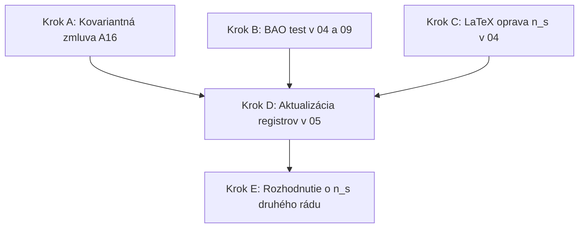

# Otázky a návrh krokov pre prechod na verziu v3.18

**Dátum:** 11. júl 2026  
**Oponent a editor:** Antigravity (Google DeepMind AI)  
**Autor:** Martin Jambor (samostatný výskumník)  
**Účel:** Záznam nových výskumných otázok, fyzikálnych stien a harmonogramu bezprostredných programových a dokumentačných úprav pre verziu v3.18.

---

## 1. Register otvorených otázok a výziev

Na základe analýzy nespracovaných materiálov a zhodnotenia stavu teórie sa do registra pridávajú a aktualizujú nasledujúce položky:

### Q11e: Odvodiť $T \propto H$ pri výstupe módov z mikrodynamiky V-vrstvy
*   **Stav:** OTVORENÁ
*   **Váha:** 3 (Vysoká priorita)
*   **Popis:** Ide o **jediný neodvodený krok** v celej opravenej derivácii spektrálneho indexu $n_s$. Všetky ostatné časti (konštantnosť $\epsilon$, plošný zákon, nasýtený Hagedornovský režim) sú buď matematicky presné, alebo merané v modeli.
*   **Význam:** Táto otázka predstavuje kľúčovú jednobodovú poruchu teórie. Vzťah $T \propto H$ nesie celú váhu predikcie pre $n_s$, teplotu zamrznutia $T_f$ a amplitúdu tenzorov $r$. Jej vyriešenie (odvodenie z mikrofyziky) je hlavnou prioritou pre teoretický vývoj po prechode na verziu v3.18.

### Q16b: Dynamický dôvod, prečo kapacitu sýtia nosiče (bozóny) a nie náklad (fermióny)
*   **Stav:** OTVORENÁ
*   **Váha:** 2
*   **Popis:** Hoci hodnota kapacity $C = g_B = 28$ (bozónové nosiče Standard Modelu) vedie k predikcii $n_s$, ktorá sedí na dáta s presnosťou $0.15\sigma$ (kým alternatívy s fermiónmi sú popravené na úrovni $2.6\text{--}6.8\sigma$), teórii chýba fundamentálny dynamický dôvod.
*   **Cieľ:** Dokázať, prečo pravidlo vena pri genéze priestoru selektuje výlučne nosičové (bozónové) stavy a ignoruje hmotný (fermiónový) náklad.

### Q17: Trojbodová štatistika ($f_{\text{NL}}$) z V-termalizácie
*   **Stav:** PRVÝ PRECHOD (Úspešne vyhodnotená)
*   **Váha:** 2
*   **Výsledky:**
    *   *Vnútorná (intrinsic) hodnota:* $f_{\text{NL}}^{\text{intr}} \sim 2/\sqrt{C_V} \sim 10^{-15}$.
    *   *Lokálna hodnota:* $f_{\text{NL}}^{\text{local}} \approx +0.01\text{--}0.05$ (podlaha jedných hodín expanzie).
*   **Verdikt:** Podmienka prežitia modelu ($f_{\text{NL}} \lesssim 5$ prežíva / $\ge 10$ smrť) je splnená s obrovskou rezervou približne dvoch rádov.
*   **Ďalší krok:** Vypracovať analýzu druhého rádu (presný tvar trojbodovej korelačnej funkcie a znamienko) pre budúce testovanie pomocou SPHEREx a LSS.

---

## 2. Register fyzikálnych stien

### W5: Mikrofyzika nukleácie (kvantové čísla vytvorenej hmoty)
*   **Popis:** Teória popisuje makroskopickú tvorbu hmoty z paliva ( Bianchiho zachovanie $\nabla T = 0$), ale chýba jej mikrofyzikálny mechanizmus. Novovzniknutá hmota musí niesť konkrétne kvantové čísla (baryónové/leptónové číslo) a spĺňať limity na stabilitu protónu.
*   **Charakter steny:** Ide o dlhodobý programový problém, nie okamžitú výpočtovú úlohu. Podobne ako stena **Z1** (emergencia Lorentzovej symetrie) a **Z11** (okrajové podmienky), táto stena nesmie byť v dokumentácii ignorovaná a musí byť priznaná ako otvorená otázka.

---

## 3. Návrh bezprostredných technických krokov (A–E)

Na dokončenie prechodu na verziu v3.18 navrhujem nasledovné kroky:

### Krok A: Kovariantné zobrazenie V1 v dokumente 04 / 04b
*   *Úloha:* Vložiť text z [Nespracovane/A16_kovariantne_zobrazenie_SK.md](file:///d:/Teoria/Nespracovane/A16_kovariantne_zobrazenie_SK.md) (a jeho EN verziu) ako novú sekciu do hlavného dokumentu `04`/`04b`.
*   *Dôsledok:* Odstránia sa externé slabiny #4 a #5. Jasne sa pomenuje voľba geodetického (momentum-free) prenosu a jeho RSD stopa.

### Krok B: BAO dištančný test
*   *Úloha:*
    1.  Rozšíriť kozmologickú pipeline v skripte `09` o BAO modul, ktorý počíta vzdialenosti $D_M(z)/r_d$, $D_H(z)/r_d$ a $D_V(z)/r_d$ pre 13 bodov DESI DR2 a porovnáva ich s dátami pomocou $\chi^2$ (kód testu je pripravený v zložke `Nespracovane` ako `verdikt_B`).
    2.  Vložiť novú tabuľku s 13 DESI bodmi a predikciami modelu do sekcie B (alebo novej A17) v dokumente `04`/`04b`.
*   *Dôsledok:* Uzavrie sa námietka #9 (a E3) číselným dôkazom $\Delta\chi^2 \approx 0$ až $-2.4$.

### Krok C: Oprava LaTeX derivácie $n_s$ v dokumente 04 / 04b
*   *Úloha:* Prepísať sekciu odvodenia $n_s$ podľa schváleného podkladu [Nespracovane/derivacia_ns_opravena_C.tex](file:///d:/Teoria/Nespracovane/derivacia_ns_opravena_C.tex):
    *   Nahradiť chybné škálovanie $\Phi \propto T$ za $A13$ škálovanie $\Phi \propto \sqrt{T}$.
    *   Pridať exponenciálny potenciál $U(\phi)$ ako mechanizmus pre $w = -1+\delta$.
    *   Vložiť argument o zanedbateľnosti kvantového kanála ($\mathcal{P}_q \sim 10^{-38}$).
    *   Preformulovať záver (akcia pokrýva pozadie, nie spektrum).
*   *Dôsledok:* Zachráni sa predikovaná amplitúda tenzorov $r < 10^{-10}$ pred okamžitou falzifikáciou.

### Krok D: Aktualizácia registrov v dokumente 05 / 05b
*   *Úloha:*
    1.  Pridať zamietnuté externé tvrdenia **E1–E4** do novej sekcie registra.
    2.  Zaznamenať mŕtvu cestu **#21** (škálovanie fluktuácií $\Phi \propto T$, ktoré preráža strop pre $r$).
    3.  Pridať nové otázky **Q11e** a **Q16b** ako otvorené.
    4.  Zapísať stenu **W5** (mikrofyzika nukleácie).
    5.  Aktualizovať otázku **Q17** (trojbodová štatistika — prvý prechod úspešný).
    6.  Pridať záznam do changelogu o verzii v3.18.

### Krok E: Rozhodnutie o $\epsilon^2$ v registrovanej $n_s$ (Rozhodnutie E)
Autor musí urobiť kľúčovú voľbu ohľadom posunu o $-0.0012$ vyvolaného druhým rádom v $\epsilon$:
*   **Možnosť (a) - Ponechať prvý rád (ODPORÚČANÁ pre v3.18):**
    *   *Akcia:* Ponechať registrovanú predpoveď $n_s = 0.9656 \pm 0.0016$. Rozdiel voči druhému rádu zdokumentovať v sekcii $n_s$ ako známu teoretickú neistotu plynúcu zo skrátenia radu.
    *   *Zdôvodnenie:* Nulový zásah do prebiehajúcej registrácie. Kill condition ($|n_s - 0.9656| > 0.004$) pokrýva obe hodnoty ($0.9656$ aj $0.9643$), takže robustnosť modelu voči smrti sa nemení.
*   **Možnosť (b) - Zaviesť druhý rád:**
    *   *Akcia:* Oficiálne zmeniť predikovanú hodnotu na $0.9643$ v tabuľke predikcií a changelogu.
    *   *Upozornenie:* Zmena registrovanej hodnoty je vážny metodický zásah a vyžaduje explicitné historické priznanie v changelogu, aby to nevyzeralo ako dodatočné "dolaďovanie" parametrov (pitval M1/M9).

---

## 4. Fronta dokumentačných a programových opráv (D6)

Zoznam konkrétnych zmien, ktoré budú vykonané v kóde a repozitári:

1.  **Skript 09 (K3 pipeline):**
    *   Opraviť disipačný faktor $\delta$ z pôvodných $0.03$ na presnú hodnotu $\delta = 0.02297$. Pridať komentár o jeho pôvode: `derived: 1 / (15.54 + 28)`.
    *   Aktualizovať kotvu pre $\chi^2$ test $S_8$: Zmeniť hodnotu $0.759 \pm 0.024$ (staré KiDS-1000) na **$0.815 \pm 0.019$** (KiDS-Legacy 2025). Pridať poznámku k obom dátovým stavom v kóde.
2.  **GitHub README:**
    *   Pridať BibTeX citáciu pre konceptový DOI ("Cite all versions").
    *   Opraviť chybnú zátvorku v URL adrese.
3.  **Zenodo Popis:**
    *   Upraviť textáciu: Zmeniť kategorické tvrdenie *"no B-modes, ever"* na presnejšie fyzikálne vyjadrenie **"no primordial B-modes"** (aby sa predišlo nedorozumeniam ohľadom neskorých šošovkových B-módov, ktoré model normálne predpovedá).
4.  **Dokument 04/04b (Main Document):**
    *   Po vložení fragmentov A16 a opravenej LaTeX derivácie odstrániť zo súborov značky konca fragmentu (`\end{document-fragment}`).
